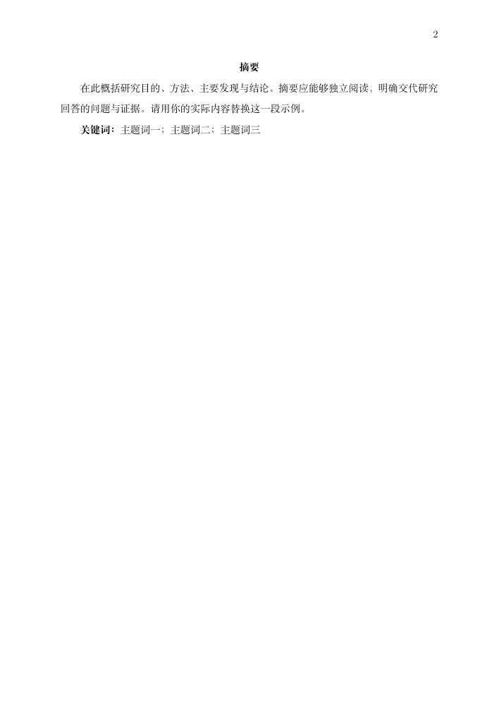
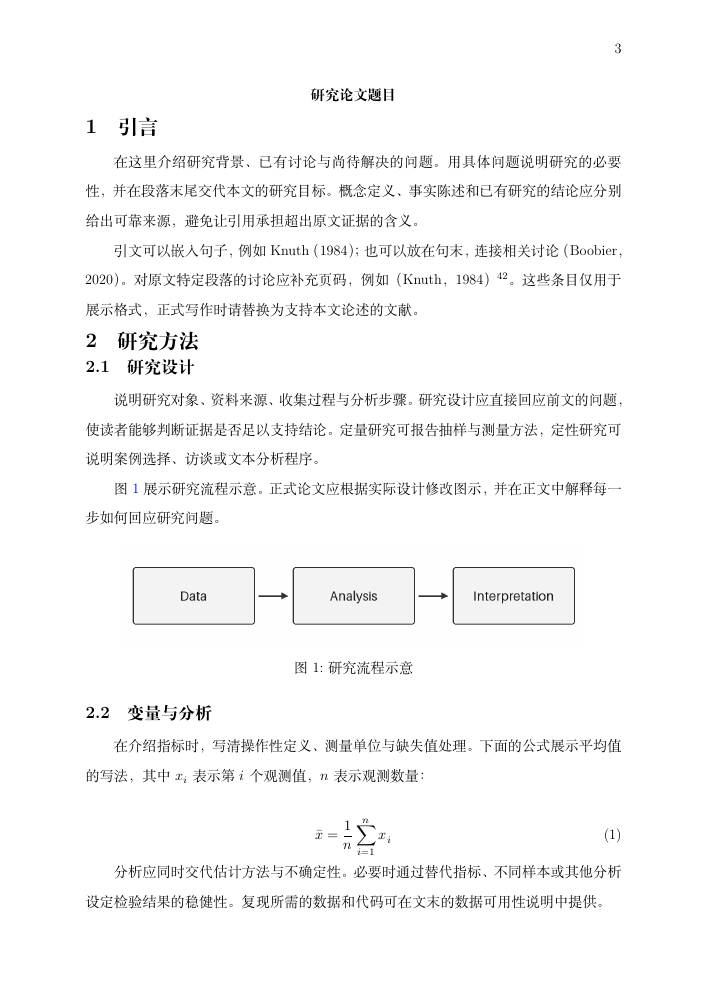

# quarto-gbt7714

**为中文学术写作的 Quarto 模板提供可复用的 GB/T 7714—2025 引用与参考文献接口。** 如果你正在维护某个学校的学位论文模板，或将现有 LaTeX 模板接入 Quarto，可以复用这里的 Lua filter 和 CSL，在自己的封面、章节与排版配置中加入中文引用支持。

本库也附带单栏稿件、双栏文章和课程作业示例，可以直接开始写作，输出 Word、PDF 或 HTML。

## 为什么做这个项目

灵感来自 [apaquarto](https://github.com/wjschne/apaquarto)：希望中文学术写作也能方便地接入 Quarto。这里把引用处理做成独立扩展，让不同学校和期刊的模板能够复用，并提供完整写作示例作为接入起点。

引用实现参考 [gbt7714-bibtex-style](https://github.com/zepinglee/gbt7714-bibtex-style)，CSL 源自 [zotero-chinese/styles](https://github.com/zotero-chinese/styles)。

## 如何使用

- **维护学校或期刊模板**：接入 `gbt7714` 引用扩展，保留自己的版式。配置见[模板适配指南](docs/citations.md)。
- **直接写作**：使用 `gbt7714-paper` 附带的单栏或双栏模板，按实际提交要求调整。配置见[写作指南](docs/writing.md)。

## 当前状态与反馈

**目前处于 beta 阶段。** 现阶段的优化和 bug 排查，主要通过 AI loop 迭代完成：构造用例、渲染输出、与上游结果对照、审查问题，再修改并做回归检查。

这样做的主要原因是：**我暂时没有实际的中文学术写作需求**，还没有用它长期完成一篇中文论文。现有测试能覆盖不少格式和边界情况，但不能代替真实写作。

欢迎大家试用，并通过 [Issues](https://github.com/lukezed/quarto-gbt7714/issues) 告诉我遇到的问题。长文档、复杂文献库、不同模板和投稿流程中，很多问题只有真正重度使用后才会出现。反馈时最好附上最小可复现的 `.qmd`、相关 `.bib` 条目、输出格式、Quarto 版本，以及预期与实际结果的截图。

当前已在 Quarto 1.10.18／Pandoc 3.10 环境验证三套模板的 Word、PDF、HTML 渲染与匿名输出；引用结果也有逐条对照测试。[使用限制](docs/citations.md#适用范围与限制)与[已知差异](docs/development.md#已知差异todo)见文档。

## 示例与预览

以下截图来自仓库内模板的实际渲染。页面中的作者、机构、正文和数据用于演示，请在写作时替换。

| 模板 | 源文件 | 完整 PDF |
|---|---|---|
| 学生作业 | [student/paper.qmd](templates/student/paper.qmd) | [查看示例](docs/previews/student.pdf) |
| 投稿初稿 | [manuscript/paper.qmd](templates/manuscript/paper.qmd) | [查看示例](docs/previews/manuscript.pdf) |
| 双栏 journal | [journal/paper.qmd](templates/journal/paper.qmd) | [查看示例](docs/previews/journal.pdf) |
| 匿名 journal | [blind 配置](templates/journal/_quarto-blind.yml) | [查看示例](docs/previews/journal-blind.pdf) |

### 双栏 journal

标题、作者、机构和摘要跨栏，正文双栏；包含图、表、公式及 GB/T 引文示例。HTML 在宽屏上也使用双栏，Word 保持单栏便于修改。


<details>
<summary>学生作业预览</summary>


</details>

<details>
<summary>投稿初稿预览</summary>

投稿版借鉴 APA 稿件的页面组织：独立标题页 → 独立摘要与关键词页 → 正文新页（重复论文标题），参考文献也另起一页。正文 12pt，PDF 与 Word 使用 25pt 正文行距。引用格式仍为 GB/T，完整排版参数见[写作指南](docs/writing.md#字号与行距)。

| 标题页 | 摘要页 | 正文首页 |
|---|---|---|
|  |  |  |

</details>

<details>
<summary>匿名 journal 预览</summary>


</details>

## 快速开始

### 接入现有模板

运行 `quarto add lukezed/quarto-gbt7714`，再添加：

```yaml
lang: zh
bibliography: refs.bib
filters: [gbt7714]
gbt7714: authoryear  # 也支持 numeric、note
```

### 直接使用写作模板

安装 [Quarto](https://quarto.org/docs/get-started/) 与 Python 3。PDF 另需含 `ctex` 和 Fandol 字体的 TeX Live／TinyTeX。

```bash
git clone https://github.com/lukezed/quarto-gbt7714.git
cd quarto-gbt7714
python3 tools/new_project.py manuscript ../my-paper
cd ../my-paper
quarto render
```

将 `manuscript` 换成 `student` 或 `journal` 即可选择其他模板。修改 `paper.qmd` 和 `refs.bib` 后渲染，结果在 `_output/`；匿名版运行 `quarto render --profile blind`，结果在 `_output-blind/`。匿名开关隐藏作者元数据和标记区块，正文与图片里的身份线索仍需自行检查。

## 详细文档

- [写作指南](docs/writing.md)：模板配置、字号与行距、匿名稿。
- [引用与模板适配](docs/citations.md)：引文写法、Word／PDF、Quarto book、natbib 与限制。
- [开发与测试](docs/development.md)：实现原理、回归检查、已知差异。

## License

见 `LICENSE`：代码 MIT；CSL 文件 CC BY-SA 3.0（派生自 [zotero-chinese/styles](https://github.com/zotero-chinese/styles)，原作者 Zeping Lee）；`test/upstream/` 为 LPPL 1.3c（[zepinglee/gbt7714-bibtex-style](https://github.com/zepinglee/gbt7714-bibtex-style)）。
