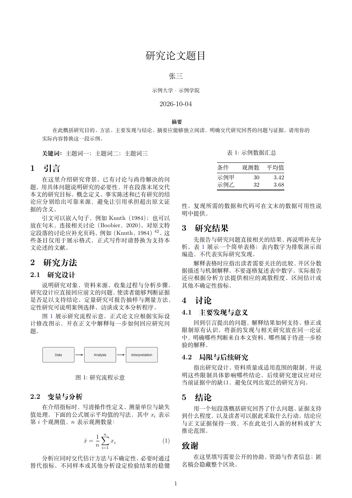
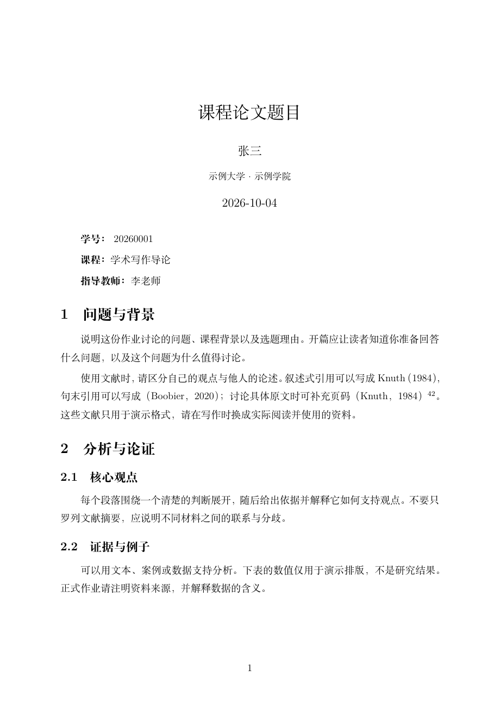
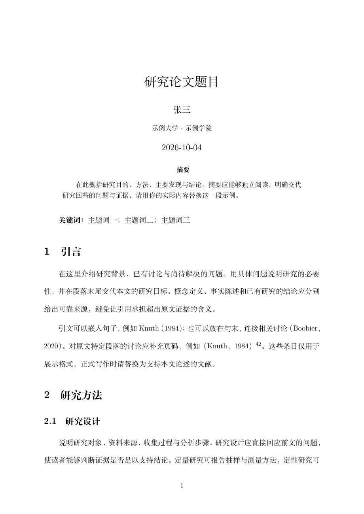
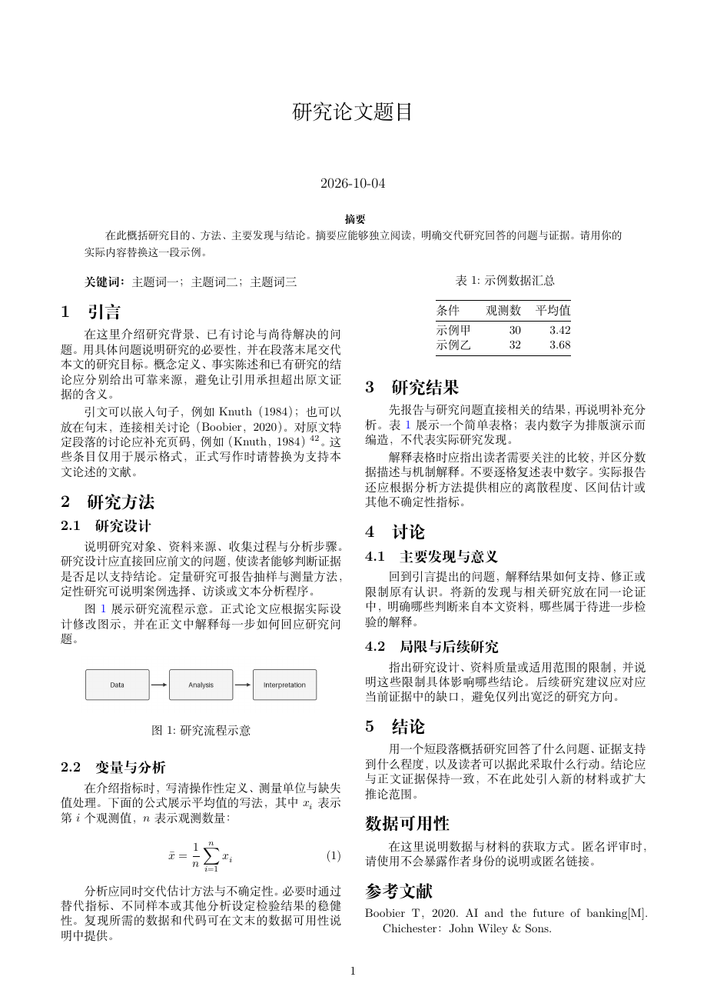

# quarto-gbt7714

面向中文学术写作的 Quarto 扩展：提供 **GB/T 7714—2025 引用与参考文献适配**，以及学生作业、投稿初稿和双栏文章模板，同一份源文件可以输出 Word、PDF 和 HTML。

## 为什么做这个项目

这个项目的灵感来自 [apaquarto](https://github.com/wjschne/apaquarto)。它把 APA 写作格式接入 Quarto，让作者可以在同一个写作流程中生成不同格式的文档。我也希望中文写作能有类似的体验：写正文、管理文献，再按需要输出文件。

在尝试把这个流程用于中文学术写作时，我没有找到能直接满足自己设想的组合：中文引用格式、多种输出，以及方便其他模板接入的 Quarto 接口。因此做了这个库，希望把 GB/T 7714 的引用规则接到 Quarto 的 Lua／CSL 工作流中，并提供几套可以直接开始写的模板。

引用实现参考了 [zepinglee/gbt7714-bibtex-style](https://github.com/zepinglee/gbt7714-bibtex-style)，CSL 源自 [zotero-chinese/styles](https://github.com/zotero-chinese/styles)。现有中文参考文献工具是这个项目的基础；本库重点处理它们在 Quarto 多格式写作中的衔接。

## 可以用来做什么

- **学生作业**：课程论文、读书报告等，填好姓名、学号、课程信息后即可开始写，最后提交 Word 或 PDF。
- **论文写作与投稿**：用单栏稿件与导师、合作者交流，也可以输出双栏 journal 风格的 PDF。考虑到投稿时可能需要 Word，而不能直接提交 PDF 或 LaTeX，本库同时保留可编辑的 Word 输出；实际版式仍需按目标期刊要求调整。
- **学校或期刊模板的引用适配**：例如 [ECNU 学位论文模板](https://github.com/sy5938/ecnu_thesis_markdown_template) 这样的项目，可以接入独立的 Lua filter 和 CSL，让引用处理沿用 Quarto 的 citeproc 流程。模板作者可以继续维护自己的封面、章节与页面布局，复用这里的中文引用功能。

仓库提供两部分：`gbt7714` 是可独立使用的引用扩展；`gbt7714-paper` 是调用它的写作排版扩展。学生、作者和模板维护者可以按需要选择。

## 当前状态与反馈

**目前处于 beta 阶段。** 现阶段的优化和 bug 排查，主要通过 AI loop 迭代完成：构造用例、渲染输出、与上游结果对照、审查问题，再修改并做回归检查。

这样做的主要原因是：**我暂时没有实际的中文学术写作需求**，还没有用它长期完成一篇中文论文。现有测试能覆盖不少格式和边界情况，但不能代替真实写作。

欢迎大家试用，并通过 [Issues](https://github.com/lukezed/quarto-gbt7714/issues) 告诉我遇到的问题。长文档、复杂文献库、不同模板和投稿流程中，很多问题只有真正重度使用后才会出现。反馈时最好附上最小可复现的 `.qmd`、相关 `.bib` 条目、输出格式、Quarto 版本，以及预期与实际结果的截图。

当前已在 Quarto 1.10.18／Pandoc 3.10 环境验证三套模板的 Word、PDF、HTML 渲染与匿名输出；引用结果也有逐条对照测试。已知差异和使用限制列在文末。

## 示例与预览

以下截图来自仓库内模板的实际渲染。页面中的作者、机构、正文和数据用于演示，请在写作时替换。

| 模板 | 源文件 | 完整 PDF |
|---|---|---|
| 学生作业 | [student/paper.qmd](templates/student/paper.qmd) | [查看示例](docs/previews/student.pdf) |
| 投稿初稿 | [manuscript/paper.qmd](templates/manuscript/paper.qmd) | [查看示例](docs/previews/manuscript.pdf) |
| 双栏 journal | [journal/paper.qmd](templates/journal/paper.qmd) | [查看示例](docs/previews/journal.pdf) |
| 匿名 journal | [blind 配置](templates/journal/_quarto-blind.yml) | [查看示例](docs/previews/journal-blind.pdf) |

### 双栏 journal

标题、作者、机构和摘要跨栏，正文双栏；包含图、表、公式及 GB/T 引文示例。HTML 在宽屏上也使用双栏，Word 保持单栏便于修改。



<details>
<summary>学生作业预览</summary>



</details>

<details>
<summary>投稿初稿预览</summary>



</details>

<details>
<summary>匿名 journal 预览</summary>



</details>

## 环境准备

- 安装 [Quarto](https://quarto.org/docs/get-started/)。HTML 和 Word 输出不依赖 LaTeX。
- PDF 输出需要 XeLaTeX 与含 `ctex`、Fandol 字体的 TeX Live／TinyTeX；写作模板默认使用 Fandol，避免依赖特定操作系统字体。
- Word 模板使用宋体、黑体与 Times New Roman；本机缺少字体时，显示效果取决于编辑器的字体替代。
- 使用下面的项目创建脚本需要 Python 3；直接安装扩展并手写 `.qmd` 不需要 Python。

## 写作起步模板

除了可独立使用的引用 filter，本仓库还提供可编辑的学生作业、投稿初稿与双栏文章模板。排版由独立的 `gbt7714-paper` 扩展提供；它调用同一套 GB/T 引用实现。模板中的页面、字体和章节设置是通用起点，学校或期刊有明确要求时请据其调整。

| 模板 | 使用场景 | PDF / HTML | Word |
|---|---|---|---|
| `student` | 课程论文、读书报告、学生作业 | 单栏，包含学号、课程、指导教师 | 可编辑单栏 |
| `manuscript` | 投稿初稿、导师审阅 | 单栏，摘要、关键词和完整正文 | 可编辑单栏 |
| `journal` | 期刊风格文章、成稿展示 | PDF 双栏；HTML 宽屏双栏、窄屏单栏 | 可编辑单栏 |

源文件分别在 [student](templates/student/paper.qmd)、[manuscript](templates/manuscript/paper.qmd)、[journal](templates/journal/paper.qmd)。先克隆或下载仓库：

```bash
git clone https://github.com/lukezed/quarto-gbt7714.git
cd quarto-gbt7714
```

从仓库根目录选择一种模板，创建带全部扩展文件的独立项目。此步骤只需 Python 3 标准库，不会改动已有目录：

```bash
python3 tools/new_project.py student /path/to/my-assignment
python3 tools/new_project.py manuscript /path/to/my-manuscript
python3 tools/new_project.py journal /path/to/my-journal-paper
```

进入新项目，修改 `paper.qmd` 的题目、作者和正文，将 `refs.bib` 换成实际使用的文献，然后运行：

```bash
quarto render                       # HTML、PDF、Word，位于 _output/
quarto render --to gbt7714-paper-pdf # 只输出 PDF
quarto render --profile blind       # 匿名版，位于 _output-blind/
```

PDF 需要 XeLaTeX 与 `ctex`。每个模板都保留正文引文、页码和表格交叉引用示例；投稿稿与双栏稿还包含图示和公式示例。示例数据仅用于排版演示，请替换后使用。Word 使用相同正文与参考文献，采用单栏便于审阅。双栏 PDF 的表格按单栏宽度排版并浮动，需能放入一页；跨页长表请使用 `manuscript` 单栏版。

若已有 Quarto 项目，只需安装本仓库的扩展并选择格式：

```yaml
format:
  gbt7714-paper-html: default
  gbt7714-paper-pdf: default
  gbt7714-paper-docx: default
paper-style: journal  # student | manuscript | journal
bibliography: refs.bib
gbt7714: authoryear   # numeric | note 也可
```

这些写作格式已经加载引用 filter，无需再添加 `filters: [gbt7714]`。只需要引用适配的项目，继续使用下文的 `filters: [gbt7714]` 即可。

### 匿名稿

在项目配置中设 `blind: true`，或使用模板附带的 `--profile blind`，即可隐藏结构化作者、机构、邮箱、ORCID、学号及课程信息。致谢、资助或其他需要在匿名版隐藏的内容放进 `.nonblind` 区块：

```markdown
::: {.nonblind}
# 致谢 {.unnumbered}

这里填写作者致谢和资助信息。
:::
```

也支持 `.author-only` 区块。`blind: false` 或不设置时，正常显示这些信息。此开关处理作者元数据和显式标记的区块，保留参考文献与自引；正文叙述、图片、文件名及外部链接中的身份线索仍需作者自行检查。

## 在已有项目中使用引用扩展

```bash
quarto add lukezed/quarto-gbt7714
```

```yaml
bibliography: refs.bib
filters: [gbt7714]
gbt7714: authoryear   # authoryear（默认）| numeric | note
```

- 文献条目不依赖 `lang`：中文条目的"等""佚名"等在任何文档语言下都正确。但 Quarto 自己生成的标题（"References""Footnotes"、图表标签）跟随 `lang`，中文文档请设 `lang: zh`。
- 中文条目要按拼音排序，需在 bib 中提供 `key` 字段（如 `key = {wang2 ming2}`），与 upstream bst 相同；没有 `key` 的中文条目按码位排在其后。
- 注释体例（`note`）：重复引用写"同N"（指向第 N 条注释）；注码放在标点前（"研究¹。"），可用 `notes-after-punctuation: true` 改回；文末同时输出参考文献表，不需要时设 `suppress-bibliography: true`。
  - "同N"按全书统一编号。book 类 PDF（`scrreprt`、`ctexbook` 等）默认每章重置脚注编号，会让"同N"指错，需让脚注全书连续：

    ```yaml
    format:
      pdf:
        include-in-header:
          text: \counterwithout{footnote}{chapter}
    ```

    HTML book 每章单独渲染，章与章之间不会出现"同N"，各章首次引用都给出完整条目。
- Word：pandoc 生成 docx 时不读 CSL 的悬挂缩进，文献表格式取决于 reference doc 的 `Bibliography` 样式。可直接用附带的模板（文献表悬挂缩进 2 字；正文宋体、标题黑体，西文 Times New Roman）：

  ```yaml
  format:
    docx:
      reference-doc: _extensions/gbt7714/gbt7714-reference.docx
  ```

  路径相对于写这一行的文件：写在项目根的 `_quarto.yml` 里如上；写在子目录 qmd 的 front matter 里要相应加 `../`。已有自己模板的，在 Word 里把 `Bibliography` 样式设为悬挂缩进即可。模板由 `tools/make_reference_docx.py` 生成。
- 正文页码写 `[@key, 42]`、`[@key, p. 42]` 或 `[@key, 第42页]`，输出为上标页码（`[1]⁴²`、`（Boobier，2020）⁴²`）。

## 中文 PDF

中文文章可用 `ctexart` 和 XeLaTeX；需安装含 `ctex` 的 TeX Live（或 TinyTeX）和可用的中文字体：

```yaml
lang: zh
bibliography: refs.bib
filters: [gbt7714]
gbt7714: authoryear
format:
  pdf:
    documentclass: ctexart
    pdf-engine: xelatex
```

`lang: zh` 控制 Quarto 的语言，`ctexart` 负责中文排版。若系统默认字体不可用，可在 `pdf` 下添加 `CJKmainfont: Songti SC`（macOS 示例），或换成已安装的中文字体。

## 从其他引用体例切换

在普通 Quarto 项目中，删除原有的 `csl: apa.csl`，再添加 `filters: [gbt7714]` 和所需的 `gbt7714` 体例。保留外部 `csl:` 会继续使用该 CSL，扩展会给出提示，并只修正文献数据。

如果使用的是 apaquarto 等带完整排版和引用流程的扩展，还需要调整对应的 `format:` 与 filters；仅替换一个 CSL 并不等于完成整套模板迁移。

正文仍使用 Pandoc 引文语法：

| 写法 | 用途（以 `authoryear` 为例） |
|---|---|
| `[@boobier2020]` | 括号引文，如 `（Boobier，2020）` |
| `@boobier2020` | 叙述式，如 `Boobier（2020）` |
| `Boobier [-@boobier2020]` | 作者已写在正文，只输出年份；按 GB/T 连写为 `Boobier（2020）` |
| `[见 @boobier2023]` | 中文前缀与中文作者连写，如 `（见博伯尔，2023）` |
| `[see @boobier2020]` | 英文前缀保留空格，如 `（see Boobier，2020）` |
| `[@boobier2020, p. 42]` | 页码移到右括号后，输出 `（Boobier，2020）⁴²` |

`-@` 表示省略作者，不是省略整条引文；`note` 体例为了让脚注条目完整，仍会保留脚注里的作者。英文前缀使用 `[see @key]`，无需手工删除 `see` 后的空格。

locator（页码或章节定位）写在逗号后。页码可写 `42`、`p. 42`、`pp. 42–45`、`第42页`；`authoryear` / `numeric` 去掉页码标签并置于括号后上标。章节定位写 `[@key, chap. 3]` 或 `[@key, 第3章]`，会保留文字并同样置于上标。`note` 体例把定位信息保留在脚注中。

## Quarto book 同时输出 HTML / PDF

共享章节时，使用以下 `_quarto.yml`。`index.qmd`、正文文件和 `refs.bib` 均相对于项目根目录：

```yaml
project:
  type: book
book:
  title: "中文书稿"
  chapters:
    - index.qmd
    - chapters/chapter01.qmd
    - chapters/chapter02.qmd
lang: zh
bibliography: refs.bib
filters: [gbt7714]
gbt7714: authoryear
reference-section-title: "参考文献"
format:
  html: default
  pdf:
    documentclass: ctexbook
    pdf-engine: xelatex
```

执行 `quarto render` 输出两种格式。各章节中不要放 `::: {#refs}`，也不要在章节清单中添加含 `#refs` 的独立参考文献页：HTML 每章末尾列出本章文献；PDF 全书合并处理，末尾列出全书文献。`numeric` 在 HTML 中各章重新编号，在 PDF 中全书连续编号。

HTML book 的独立 `#refs` 页由 Quarto 另起一个不加载扩展的 Pandoc 进程生成，无法保证 GB/T 的数据修正与排序。仅输出 PDF / docx 的 book 可以使用独立参考文献页；需要指定位置时，在专用配置的 `book.chapters` 中加入 `references.qmd`，内容如下：

```markdown
# 参考文献 {.unnumbered}

::: {#refs}
:::
```

## 文献表标题

自动放在文末的文献表可用 `reference-section-title: "参考文献"` 设置标题。需要自己安排标题和位置时，在单篇文档或仅输出 PDF / docx 的 book 中使用上面的标题与 `#refs` 块。两种方式选一种，避免重复标题；HTML book 请使用 `reference-section-title`。

## PDF 使用 natbib，与 HTML 共存

同一份正文可让 HTML 由本扩展处理，PDF 交给 upstream 的 LaTeX 宏包。以下配置需要 TeX 环境中已安装 upstream `gbt7714` 宏包及对应的 `.bst`：

```yaml
lang: zh
bibliography: refs.bib
filters: [gbt7714]
gbt7714: authoryear
reference-section-title: "参考文献"
format:
  html: default
  pdf:
    documentclass: ctexart
    pdf-engine: xelatex
    cite-method: natbib
    biblio-style: gbt7714-authoryear
    include-in-header:
      text: |
        \usepackage{gbt7714}
```

此时 `gbt7714: authoryear` 选择 HTML 的 CSL，`biblio-style: gbt7714-authoryear` 选择 PDF 的 bst。切换顺序编码制时，两项分别改为 `numeric` 和 `gbt7714-numeric`。PDF 不经过本扩展的数据修正或引文改写，效果由 upstream 宏包决定；`note` 没有对应的 upstream bst。

## 适用范围与限制

- **只作用于 citeproc**。`cite-method: natbib` / `biblatex` 时 filter 不做任何事，PDF 交给 LaTeX（可直接用 upstream 的 `gbt7714` 宏包）。
- **Typst**：Quarto 的 typst 默认用 Typst 原生引用，不经过 CSL filter；要用本格式，在 `format: typst` 下设 `citeproc: true`（filter 会给出提示）。
- **Quarto book（HTML）**：Quarto 每章单独跑 citeproc，references 页由 Quarto 另起一个不带 filter 的 pandoc 生成，extension 无法介入。因此：
  - book 的 **PDF / docx** 支持全书合并渲染（全书一次 citeproc，numeric 编号跨章连续）；
  - book 的 **HTML** 请不要放 `::: {#refs}` 参考文献页，改为每章末尾显示本章文献（格式正确；numeric 编号章内连续；完整配置见上文）；
  - 单文档、website 不受影响。
- **numeric 编号压缩**（`[1-3]`、`[7-8]`）要在 citeproc 之后处理，而 Quarto 的 filter 都在 citeproc 之前运行，所以 numeric 下 filter 先自己跑一次 citeproc 渲染正文引文，文献表仍由 Quarto 照常生成（标题、appendix、悬停预览不受影响）。`citation-location: margin` 时跳过这一步，编号不压缩（`[1–3]`）。
- **自带 `csl:`**：指向非本扩展的 CSL（如 APA）时，filter 给出提示并只做数据修正（类型、姓名、标题大小写等），不做 GB/T 专属的引文改写（叙述式、上标页码、编号压缩）。
- **`appendix-cite-as`**（文章自身的"引用格式"）由 Quarto 在 filter 之前生成，只认 YAML 里的 `csl:`；要让它也用 GB/T 格式，显式写 `csl: _extensions/gbt7714/gbt7714-authoryear.csl`（或对应体例）。
- 只扫描 `.bib` 文件补字段；CSL-JSON / YAML 文献库可用，但 bib 专有字段（`key`、`langid` 等）自然没有。

## 工作原理

- `_extensions/gbt7714/gbt7714-*.csl`：最初由 [zotero-chinese/styles](https://github.com/zotero-chinese/styles) 的 2025 双语 CSL-M 样式经 `tools/provenance/cslm2csl.py` 转换（仅作出处记录，**不要重跑**），此后 CSL 文件本身就是源码，按 golden test 修正。
- `gbt7714.lua`：补上 CSL 和 pandoc 做不到的部分，规则都照搬 bst：
  - 语言判断（`set.entry.lang`）、中英文分支、排序 key（`presort`）；
  - 英文标题 sentence case、全角标点、姓名格式（拼音名不缩写等）、版次与卷；
  - 补回 pandoc 读 bib 时丢失的类型与字段（`@standard`、`@map`、`@preprint`、专利权人、比例尺、CSTR、`\quad` 等）；
  - 正文引文：叙述式 `@key`、上标页码。

## Golden test

```bash
python3 test/compare.py            # 全部模式；也可指定 authoryear / numeric / note / note-cite / cite-authoryear / cite-numeric
python3 test/compare.py numeric -v # 显示逐条差异
python3 test/compare.py --check    # 与 test/baseline.json 比，任何原本一致的条目或排序退步即 exit 1
python3 test/compare.py --update   # 确认是真修好后，重写 baseline
python3 test/test_bib_scan.py      # bib 原文扫描的边界情况
python3 test/test_citation_errors.py # 省略作者、自定义 CSL 提示与错误诊断
python3 test/test_multi_narrative.py # 多条叙述式引文与脚注
python3 test/test_bibliography_heading.py # 自动标题与显式文献表标题
python3 test/test_blind.py --pdf  # HTML/Word/PDF 匿名与署名输出
sh example/arch-cases/run.sh      # Quarto 集成（标题、交叉引用、margin、GFM）
```

用 upstream bst（`test/upstream/`）与本 CSL 分别渲染 GB/T 7714—2025 标准原文的 344 条示例（`gbt7714-examples.bib`），逐条比对。pandoc 侧用 Quarto 自带的 pandoc、用户默认设置（不设 `lang`）。注释体例 upstream 没有，`note`（文献表）与 `note-cite`（每条文献的首次引用脚注）对照 bst numeric 文献表。upstream 更新时，替换 `test/upstream/` 后跑 `--check`。

当前（严格比对）：

| 对比 | 一致 |
|---|---|
| 文献表 numeric | 343/344 |
| 文献表 authoryear | 339/344 |
| 注释体例文献表（`note`） | 343/344 |
| 注释体例首次引用（`note-cite`） | 342/344 |
| 正文引文 numeric（`cite-numeric`） | 23/23 |
| 正文引文 authoryear（`cite-authoryear`） | 23/23 |

## 纯 pandoc 用法

`-L` 必须写在 `--citeproc` **之前**（与 Quarto 相同：先跑 filter，再由 citeproc 生成文献表）：

```bash
pandoc paper.md --bibliography refs.bib -M gbt7714=numeric \
  -L _extensions/gbt7714/gbt7714.lua --citeproc -o paper.docx
```

## 已知差异（TODO）

- [x] numeric 连续编号压缩为 `[7-8]`、`[1-2,5]`（filter 自行调用 citeproc 后压缩）
- [x] authoryear 中文前缀连写：`（见博伯尔，2023）`；英文前缀保留空格
- [ ] authoryear 消歧后缀：bst 把"[2025]"（无出版年）与"2025"分开计，citeproc 合并计（4 条）
- [ ] 丛书名 + 卷 + 书名的片段示例 `中国科学技术史：第二卷 科学思想史`（1 条）
- [ ] 注释体例：只有日期的片段示例 `[1936]` 首次引用脚注为空（1 条）
- [ ] 同姓不同名作者的正文引文消歧（filter 自拼的作者名）

## 数据规范

与 upstream bst 相同，以下写法不会被纠正，请在 bib 中改好：

- 多位作者只能用 ` and ` 分隔：`author = {张三 and 李四}`。知网等导出的 `张三,李四`、`王五;赵六` 会被当成一个作者。
- 页码范围用 `-` 或 `--`：`pages = {45--67}`。`45~67` 中的 `~` 是 TeX 的不换行空格，会输出成"45 67"。
- 英文文献的标题按 sentence case 转换（与 upstream 相同）。专有名词和缩写要用额外的 `{}` 保护，例如 `title = {A Study of {Python} and {NASA}}`，输出保留 `Python`、`NASA`；包住整个字段值的最外层 `{}` 不算大小写保护。英文 `booktitle` 也遵循这一规则，期刊名保留原有大小写。
- 语言优先看 `langid`/`language`（`chinese`、`zh`、`zh-CN` 等均视为中文；`zh-CN` 这类代码 upstream 视为其他语言，此处按中文处理），没有时按第一个非空字段的文字判断。

## License

见 `LICENSE`：代码 MIT；CSL 文件 CC BY-SA 3.0（派生自 [zotero-chinese/styles](https://github.com/zotero-chinese/styles)，原作者 Zeping Lee）；`test/upstream/` 为 LPPL 1.3c（[zepinglee/gbt7714-bibtex-style](https://github.com/zepinglee/gbt7714-bibtex-style)）。
