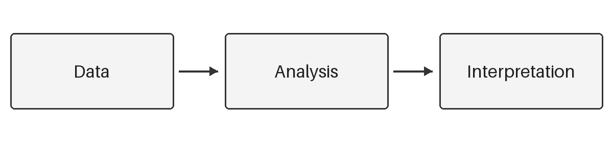

# 引言

在这里介绍研究背景、已有讨论与尚待解决的问题。用具体问题说明研究的必要性，并在段落末尾交代本文的研究目标。概念定义、事实陈述和已有研究的结论应分别给出可靠来源，避免让引用承担超出原文证据的含义。

引文可以嵌入句子，例如 @knuth1984；也可以放在句末，连接相关讨论 [@boobier2020]。对原文特定段落的讨论应补充页码，例如 [@knuth1984, 42]。这些条目仅用于展示格式，正式写作时请替换为支持本文论述的文献。

# 研究方法

## 研究设计

说明研究对象、资料来源、收集过程与分析步骤。研究设计应直接回应前文的问题，使读者能够判断证据是否足以支持结论。定量研究可报告抽样与测量方法，定性研究可说明案例选择、访谈或文本分析程序。

@fig-workflow 展示研究流程示意。正式论文应根据实际设计修改图示，并在正文中解释每一步如何回应研究问题。

{#fig-workflow width=85% fig-alt="流程依次为资料、分析与解释"}

## 变量与分析

在介绍指标时，写清操作性定义、测量单位与缺失值处理。下面的公式展示平均值的写法，其中 $x_i$ 表示第 $i$ 个观测值，$n$ 表示观测数量：

$$
\bar{x} = \frac{1}{n}\sum_{i=1}^{n}x_i
$$ {#eq-mean}

分析应同时交代估计方法与不确定性。必要时通过替代指标、不同样本或其他分析设定检验结果的稳健性。复现所需的数据和代码可在文末的数据可用性说明中提供。

# 研究结果

先报告与研究问题直接相关的结果，再说明补充分析。@tbl-example 展示一个简单表格；表内数字为排版演示而编造，不代表实际研究发现。

| 条件 | 观测数 | 平均值 |
|:-----|-------:|-------:|
| 示例甲 | 30 | 3.42 |
| 示例乙 | 32 | 3.68 |

: 示例数据汇总 {#tbl-example}

解释表格时应指出读者需要关注的比较，并区分数据描述与机制解释。不要逐格复述表中数字。实际报告还应根据分析方法提供相应的离散程度、区间估计或其他不确定性指标。

# 讨论

## 主要发现与意义

回到引言提出的问题，解释结果如何支持、修正或限制原有认识。将新的发现与相关研究放在同一论证中，明确哪些判断来自本文资料，哪些属于待进一步检验的解释。

## 局限与后续研究

指出研究设计、资料质量或适用范围的限制，并说明这些限制具体影响哪些结论。后续研究建议应对应当前证据中的缺口，避免仅列出宽泛的研究方向。

# 结论

用一个短段落概括研究回答了什么问题、证据支持到什么程度，以及读者可以据此采取什么行动。结论应与正文证据保持一致，不在此处引入新的材料或扩大推论范围。

::: {.nonblind}
# 致谢 {.unnumbered}

在这里填写需要公开的协助、资助与作者信息；匿名稿会隐藏整个区块。
:::

# 数据可用性 {.unnumbered}

在这里说明数据与材料的获取方式。匿名评审时，请使用不会暴露作者身份的说明或匿名链接。

# 参考文献 {.unnumbered}

::: {#refs}
:::
